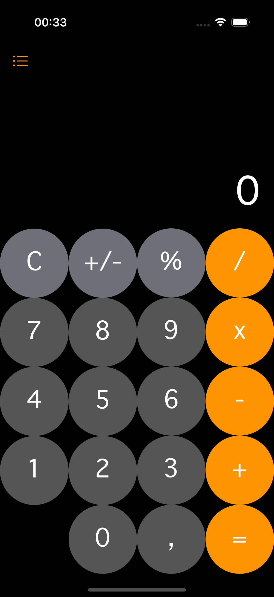
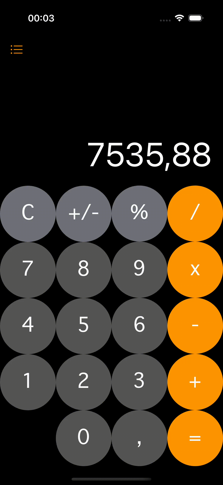

# Калькулятор на Swift



Простой и удобный калькулятор для iOS, написанный на Swift с использованием Storyboard. Приложение поддерживает базовые арифметические операции, обрабатывает ошибки (например, деление на ноль), а также сохраняет историю вычислений и отображает её в отдельном экране.

## Оглавление
- [Особенности](#особенности)
- [Скриншоты и GIF](#скриншоты-и-gif)
- [Установка](#установка)
- [Использование](#использование)
- [Технологии](#технологии)
- [Лицензия](#лицензия)
- [Автор](#автор)

## 🚀 Особенности
- **Базовые операции**: сложение, вычитание, умножение, деление.
- **Обработка ошибок**: корректная обработка деления на ноль.
- **История вычислений**: все операции сохраняются локально и отображаются в отдельном экране.
- **Анимации**: плавные анимации при нажатии кнопок и переходах между экранами.
- **Локальное хранение**: история вычислений сохраняется даже после перезапуска приложения.

## 📸 Скриншоты и GIF



## 🛠 Установка
1. Клонируйте репозиторий:
   ```bash
   git clone https://github.com/midaaaa/CalculatorFirst.git
   ```
2. Откройте проект в Xcode:
   ```bash
   open CalculatorFirst.xcworkspace
   ```
3. Запустите проект на симуляторе или физическом устройстве.

## 🧑‍💻 Использование
- **Основной экран**:
  - Введите числа и выберите операцию (+, -, *, /).
  - Нажмите "=" для получения результата.
  - Используйте кнопку "C" для очистки текущего ввода.
  - При делении на ноль отображается анимированное сообщение "Undefined".

- **Экран истории**:
  - Нажмите кнопку "История" для перехода к списку всех выполненных операций.
  - История сохраняется локально и доступна даже после перезапуска приложения.

## 🛠 Технологии
- **Язык**: Swift
- **Интерфейс**: Storyboard
- **Локальное хранение**: UserDefaults
- **Анимации**: UIKit
- **Обработка ошибок**: Swift Error Handling

## 📜 Лицензия
Copyright (c) 2025 Filimonov Dmitriy

## 👤 Автор
- **Ваше имя**: [GitHub](https://github.com/midaaaa)
- **Связь**: fildimaan@mail.ru
